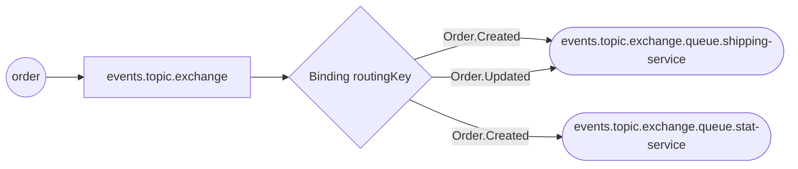

# Event stream

To publish events to the default event stream we need to create a `EventStreamPublisher` with a `Publisher` which maps types
and routing keys.

Let's start with the `Publisher`

```go
orderPublisher := Must(NewPublisher(
    Route{Type: OrderCreated{}, Key: "Order.Created"},
    Route{Type: OrderUpdated{}, Key: "Order.Updated"}))
```

The created `orderPublisher` can now be used to publish both `OrderCreated` and `OrderCreated`  for  different routing
keys.
Let's attach it to the stream

```go
orderServiceConnection.Start(EventStreamPublisher(orderPublisher))
```

No we can publish events:

```go
orderPublisher.Publish(OrderCreated{Id: "id"})
orderPublisher.Publish(OrderUpdated{Id: "id"})
```

Since no one is consuming the events they will of course just be dropped. Let's set up some consumers as well

The Stat service is only interested in created orders, so we just consume those events:
```go
connection = Must(NewFromURL("stat-service", amqpURL))
connection.Start(
    EventStreamConsumer("Order.Created", handleOrderEvent, OrderCreated{}),
)
...

func handleOrderEvent(msg any, headers Headers) (response any, err error) {
	switch msg.(type) {
	case *OrderCreated:
		fmt.Println("Increasing order count")
	default:
		fmt.Println("Unknown message type")
	}
	return nil, nil
}
```

The Shipping service is interested in all events for orders:
```go
connection = Must(NewFromURL("shipping-service", amqpURL))
connection.Start(
    EventStreamConsumer("Order.Created", s.handleOrderEvent, OrderCreated{}),
    EventStreamConsumer("Order.Updated", s.handleOrderEvent, OrderUpdated{}),
)
...

func handleOrderEvent(msg any, headers Headers) (response any, err error) {
    switch msg.(type) {
    case *OrderCreated:
        fmt.Println("Order created")
    case *OrderUpdated:
        fmt.Println("Order deleted")
    default:
        fmt.Println("Unknown message type")
    }
    return nil, nil
}
```
For both the stat- and shipping-service we define `HandlerFunc`s that process the incoming messages.

## AMQP
A number of queues, bindings and exchanges are now created to allow the events to flow from the publisher to the consumers.
The publisher publish a message to the exchange `events.topic.exchange`, this is the default event exchange and from the
naming convention it is clear that it is a topic exchange.

For the `events.topic.exchange` multiple bindings for `routingKey` is created to the different consumer queues.
The shipping-service will consume messages from the queue `events.topic.exchange.queue.shipping-service`, and the
stat-service from `events.topic.exchange.queue.stat-service`.
Notice the naming convention: `<exchangename>.queue.<consumername>`.

Since the Shippping-service is interested in both `Order.Created` and `Order.Updated` events two bindings are created,
one for each routing key.
And the Stat-service is interested in only `Order.Created` events so a single binding is created.



See a full example in [example_test.go](./example_test.go)
