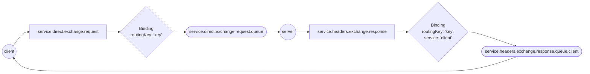

# Request response

For a request-response set up the server creates a `RequestResponseHandler` with a `EventHandler` for a particular type.

```go
func handleRequest(ctx context.Context, m goamqp.ConsumableEvent[Request]) (any, error) {
    response := Response{Data: m.Payload.Data}
    return response, nil
}
RequestResponseHandler(routingKey, handleRequest),
```

A client who wants to send a request to the server needs to publish a message with a `ServicePublisher` and handle the
response with a `ServiceResponseConsumer`.

```go
func handleResponse(ctx context.Context, m goamqp.ConsumableEvent[Response]) error {
    fmt.Printf("Got response, %v", m.Payload.Data)
    return nil
}

WithTypeMapping(routingKey, Request{}),
ServicePublisher("service", publisher),
ServiceResponseConsumer("service", routingKey, handleResponse)
```

## AMQP

A number of queues, bindings and exchanges are now created to allow the request and response to flow from the client to
the server and back again.
A client publish a message to the service's request exchange `service.direct.exchange.request`, notice  the naming
convention for request exchanges: `<requestee>.direct.exchange.request` indicating that it is a direct exchange.

For the `service.direct.exchange.request` a binding with  `routingKey: 'key'` is created to the
`service.direct.exchange.request.queue`. Again notice the naming convention for the request receiver queue:
`<requestee-request-exchange-name>.queue`.

From this queue the defined `HandlerFunc` will process the message, and it's response will be sent to the exchange
`service.headers.exchange.response`.
The naming pattern for the response exchange is `<requestee>.headers.exchange.response` indicating that it is a header
exchange.

For the `service.headers.exchange.response` a binding with both `routingKey: 'key'` and `service: 'client'` (which is a
header) is created to the `service.headers.exchange.response.queue.client` queue.
This ensures that the calling service gets the response and not another service making a request, since the service
name is part of the binding.
Notice the naming convention on the response queue for the client
`<requestee-response-exchange-name>.queue.<requester>`

**Note:** there is no guarantee that the calling instance will receive the response,
just the queue. If multiple service instances are running one of them will receive the response.



See a full example in [example_test.go](./example_test.go)
